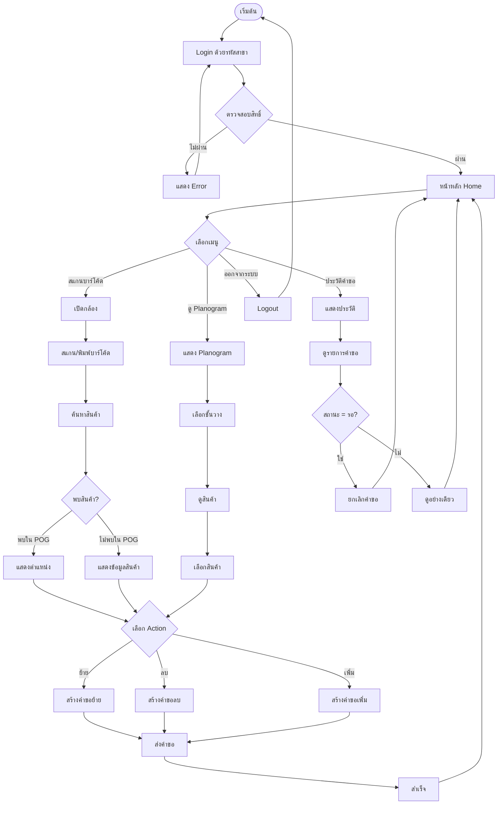
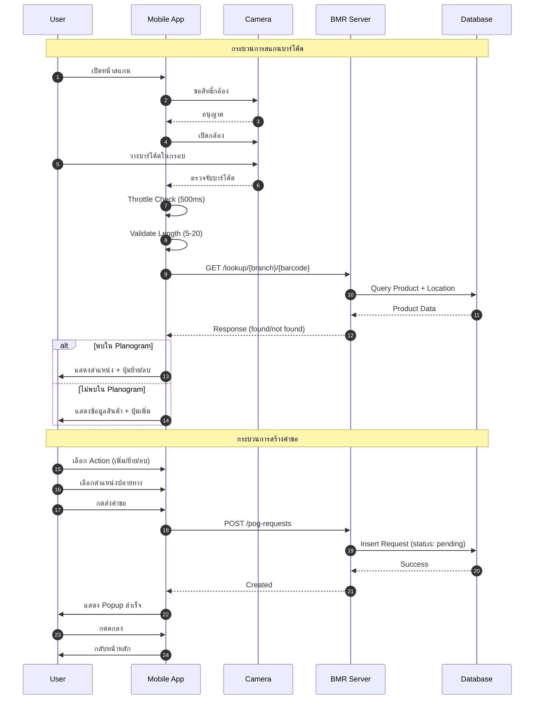
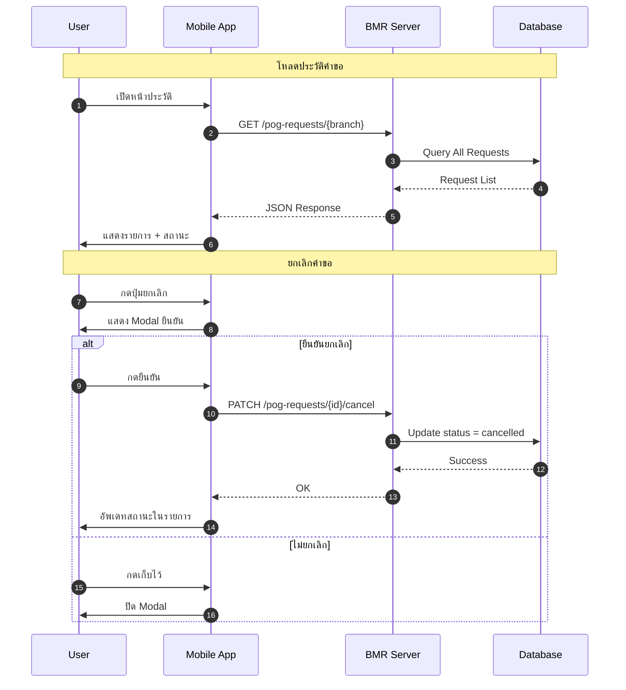
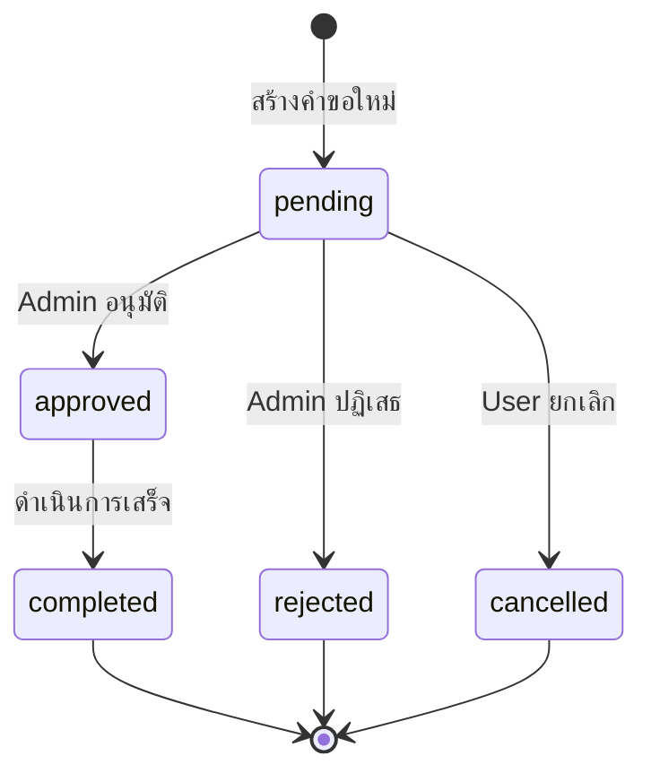

# 📊 Mobile BMR Planogram - System Diagrams

## 1. Activity Diagram - ภาพรวมการทำงานของระบบ

### คำอธิบาย Activity Diagram

| ขั้นตอน | รายละเอียด |
|---------|-----------|
| **Login** | ผู้ใช้เลือกสาขาและกรอกรหัสผ่านเพื่อเข้าสู่ระบบ |
| **Home** | แสดงเมนูหลัก 4 รายการ: สแกน, Planogram, ประวัติ, รายงาน |
| **Scanner** | ใช้กล้องสแกนหรือพิมพ์บาร์โค้ดเพื่อค้นหาสินค้า |
| **Lookup** | ระบบค้นหาสินค้าใน Planogram และ Master Database |
| **Action** | เลือกการดำเนินการ: เพิ่ม/ย้าย/ลบ ตามเงื่อนไข |
| **Submit** | ส่งคำขอไปยัง Server รอ Admin อนุมัติ |
| **History** | ดูประวัติคำขอทั้งหมด สามารถยกเลิกได้ถ้ายังรอดำเนินการ |

---

## 2. Sequence Diagram - การสแกนบาร์โค้ดและสร้างคำขอ

### คำอธิบาย Sequence Diagram

| ลำดับ | Component | Action | รายละเอียด |
|-------|-----------|--------|-----------|
| 1-4 | User → Camera | ขอสิทธิ์กล้อง | ตรวจสอบและขอ Permission |
| 5-6 | Camera → App | สแกนบาร์โค้ด | ตรวจจับและส่งข้อมูล |
| 7-8 | App | Validation | ป้องกันสแกนซ้ำ/ผิดพลาด |
| 9-12 | App → Server | API Call | ค้นหาสินค้าใน Database |
| 13-14 | App → User | แสดงผล | ตามผลลัพธ์การค้นหา |
| 15-17 | User → App | สร้างคำขอ | กรอกข้อมูลและยืนยัน |
| 18-21 | App → Server | บันทึก | สร้าง Record ใน Database |
| 22-24 | App → User | Success | แจ้งผลและกลับหน้าหลัก |

---

## 3. Sequence Diagram - การดูและยกเลิกประวัติคำขอ

---

## 4. API Endpoints ที่ใช้งาน

| Method | Endpoint | Description |
|--------|----------|-------------|
| `POST` | `/auth/branch-login` | Login ด้วยรหัสสาขา |
| `GET` | `/shelves/{branch}` | ดึงข้อมูล Planogram |
| `GET` | `/lookup/{branch}/{barcode}` | ค้นหาสินค้าจากบาร์โค้ด |
| `POST` | `/pog-requests` | สร้างคำขอเปลี่ยนแปลง |
| `GET` | `/pog-requests/{branch}` | ดึงประวัติคำขอ |
| `PATCH` | `/pog-requests/{id}/cancel` | ยกเลิกคำขอ |

---

## 5. สถานะคำขอ (Request Status Flow)

| สถานะ | คำอธิบาย | User Action |
|-------|---------|-------------|
| **pending** | รอดำเนินการ | ยกเลิกได้ |
| **rejected** | ถูกปฏิเสธ | ดูได้อย่างเดียว |
| **completed** | เสร็จสิ้น | ดูได้อย่างเดียว |
| **cancelled** | ยกเลิกแล้ว | ดูได้อย่างเดียว |
